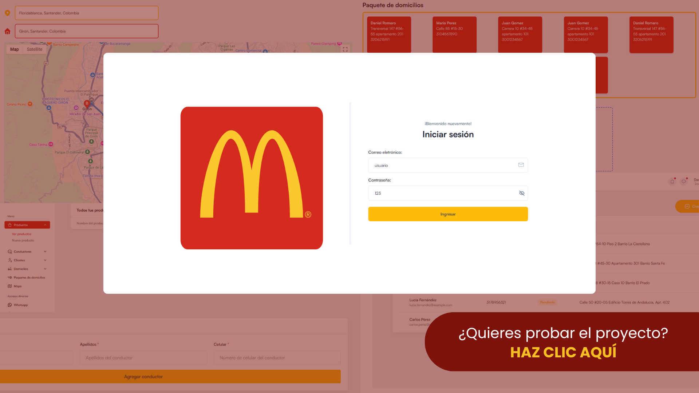
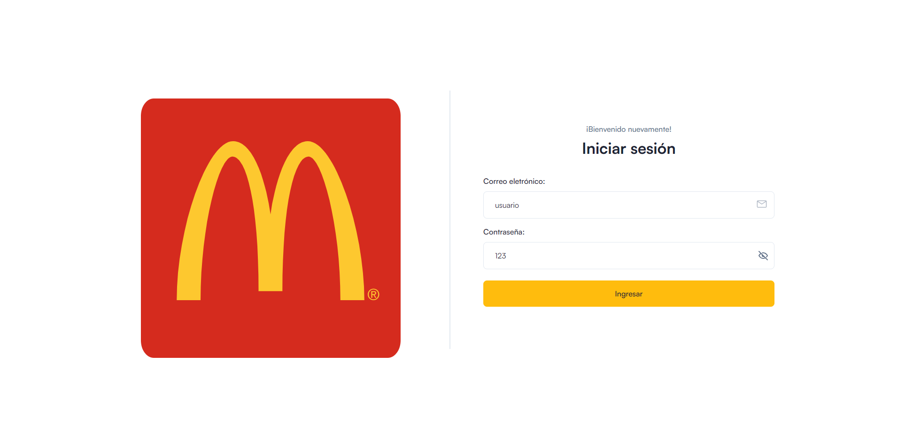
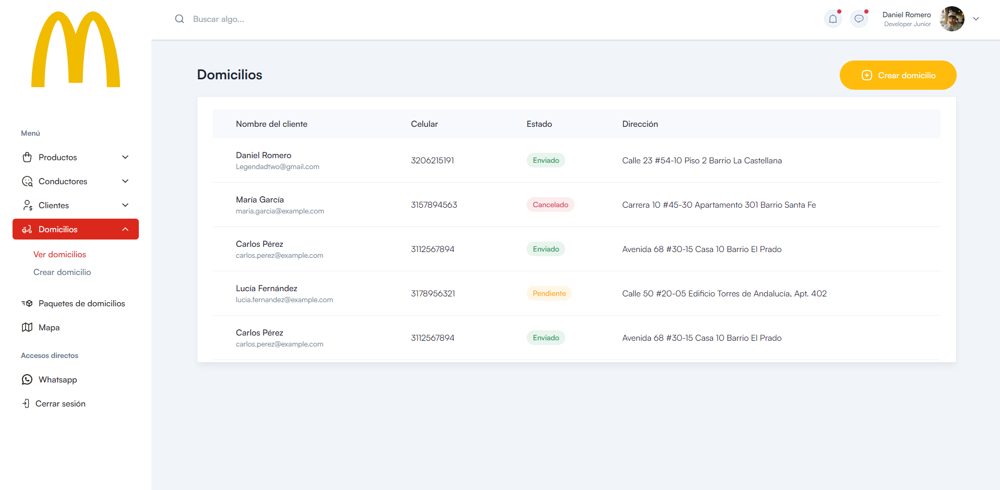
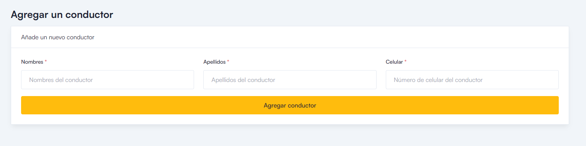
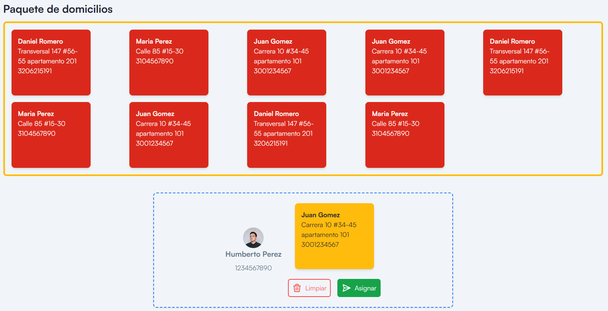
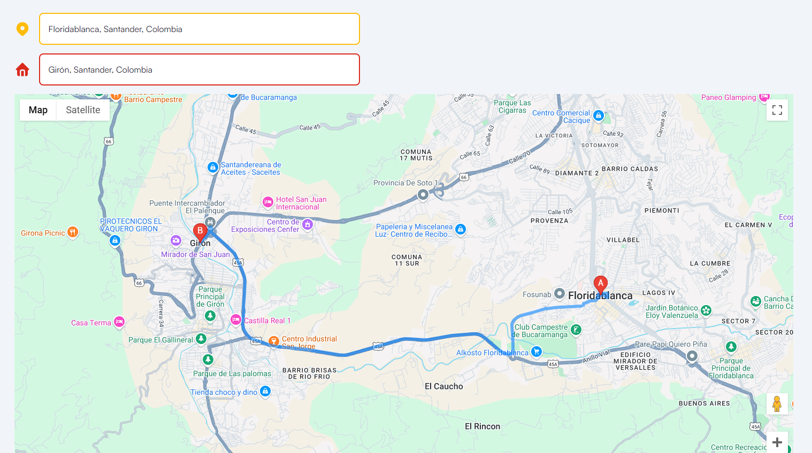
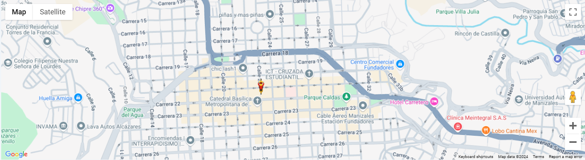

> [!TIP]
> Inicia sesión con cualquier usuario y contraseña.

## Admin Delivery

 

### ¿Qué es Admin Delivery?
Es un dashboard backoffice pensado en administrar los envíos de productos, fue creado como proyecto de aprendizaje  usando React, Next Js y Tailwind.
En el Admin delivery podrá encontrar:
- Gestor inventarios
- Gestor de usuarios
- Asignar pedidos mediante Drag and Drop
- Mapa de Google Maps

 
 
## ¡Echale un vistazo!
### Login
Login funcional, actualmente podrás ingresar con cualquier usuario y contraseña, pero tiene una lógica para generar el Token de acceso usando validación de GraphQl.

 
### Tablas y Formularios
Existen diferentes tablas para ver repartidores, usuarios, productos... Además los formularios permiten para agregar datos a estas tablas, actualmente no muestran los datos pues no tiene Backend, pero en su momento funcionaba todo el CRUD con GraphQL.

 
### Drag and Drop
Creamos una funcionalidad para asignar un domicilio a un repartidor de forma fácil y rápido, solamente se debe arrastrar el domicilio hacia su repartidor.

 
### Mapa
API de Google Maps permite ingresar ubicaciones dentro de Colombia y genera la ruta más rápida. Además estabamos trabajando en ver la ubicación del repartidor mientras se dirige a su destino, tipo Uber o Rappi.

 
 
> [!NOTE]
> Quiero agradecer profundamente a MedusaLab por su apoyo, espacio y acompañamiento durante la creación de este proyecto de aprendizaje. ¡Gracias por todo!
